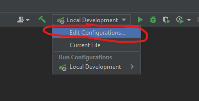
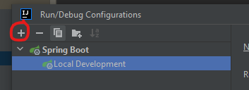
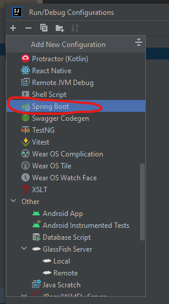
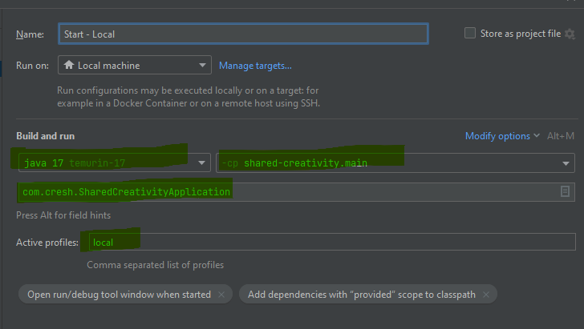
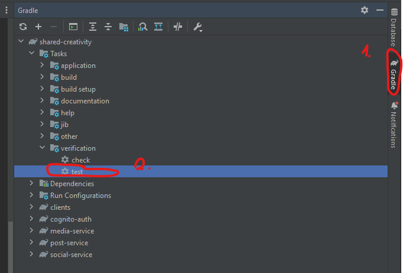

# 👩‍💻 Quick start
This is a simple tutorial for local development.

- 🐳 [Install Docker](InstallDocker.md)
- ▶️  [Running App](#-running-app)
- 🚦 [Running Tests](#-running-tests)

# ▶️ Running app
## 💡 Requirements
- Intelij Idea

## ✏️ Setup profile
This is a tutorial how to configure `Intelij Idea Profile`
### 1️⃣ Click Edit:



### 2️⃣ Click ➕:



### 3️⃣ Chose `Spring boot` 🌱:


---
### 4️⃣ Next enter theese `3 inputs` like this 📝:



# 🚦 Running Tests
This is a tutorial how to run all tests for app. There are two ways to run tests.
### 1️⃣ Running using Gradle Plugin `Intelij Idea`

### 2️⃣ Running using terminal `Gradle`
Enter to terminal this command:
```shell
./gradlew test
```
