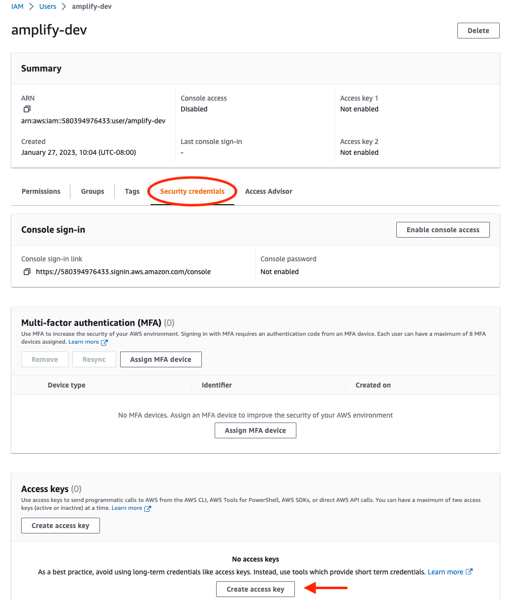
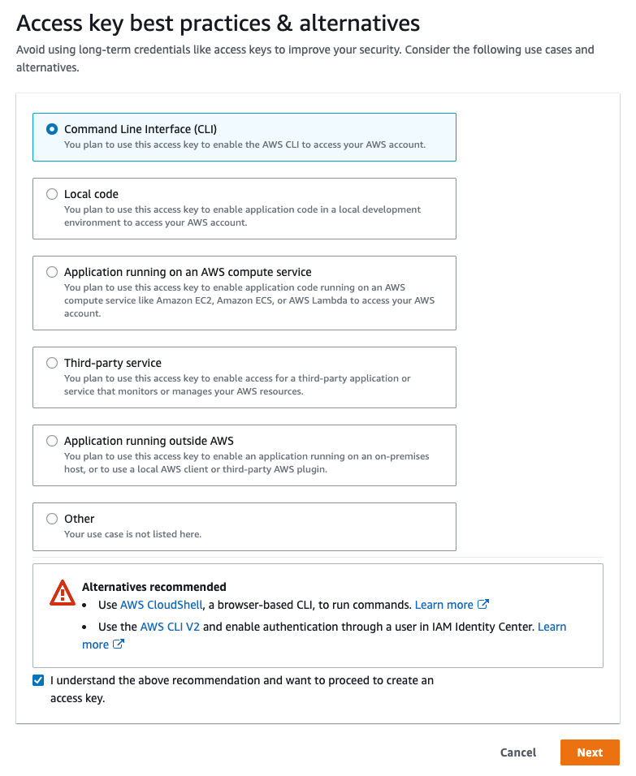
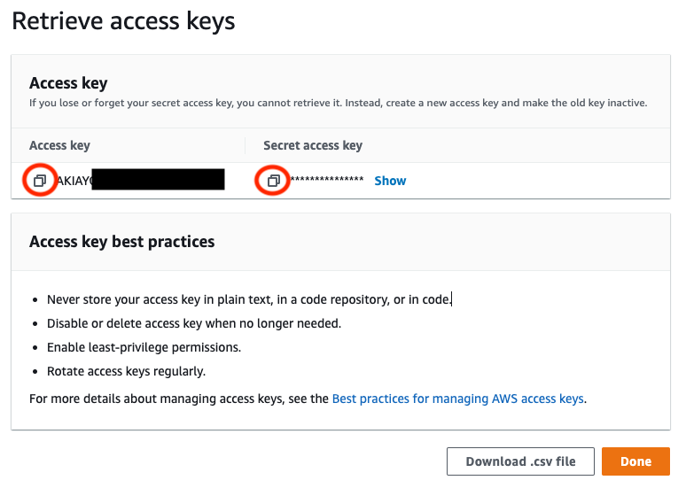
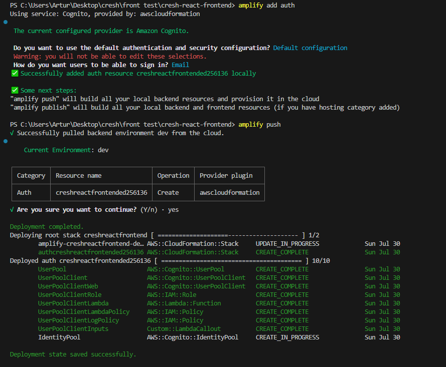

# How to setup Cognito - Amplify

The official link describing AWS cognito integrations can be found [here](https://docs.amplify.aws/cli/start/install/#configure-the-amplify-cli).

## Getting Started

First of all you have to install dependencies.

```bash
yarn install
```

You must have a user in the AWS cresh console. For more information click [here](https://cresh-creativity-share.github.io/docs/docs/AWS/)

Next initialize amplify.

```bash
amplify init
```
The correct initialization is shown below. Remember, to select the appropriate editor, and to choose the method of authentication through AWS access keys

[amplify initialization](images/init_1.PNG)

To obtain an access key, log in to AWS IAM, select your user and follow the instructions below







In the next step, you have to add auth configuration.

In this step, use the following commands

```bash
amplify add auth
```

```bash
amplify push
```

This will ensure that the environment variables are downloaded into the aws-export file. 

This will help you get all the necessary environment variables.
Chose previous seted AWS profile.

The following is the correct configuration of the auth add command.




After all this steps you have all necessary data related to your profile in aws-exports.js file

Next, run the development server:

```bash
yarn dev
```

Open [http://localhost:3000](http://localhost:3000) with your browser to see the result.