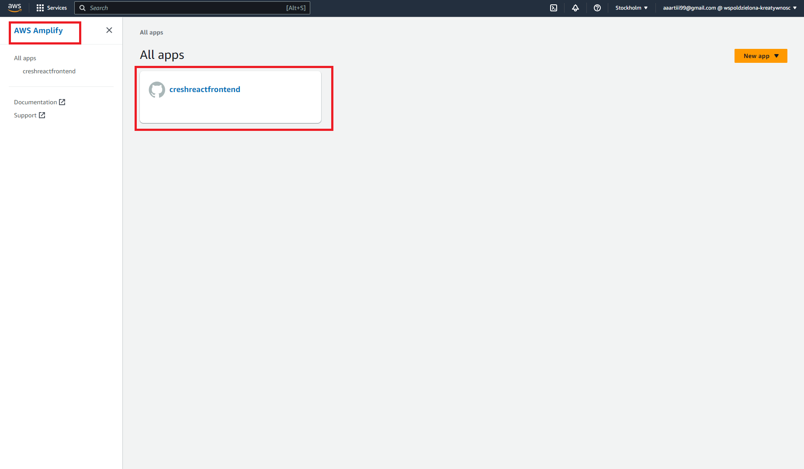

# How to setup Cognito - Amplify

The official link describing AWS cognito integrations can be found [here](https://docs.amplify.aws/cli/start/install/#configure-the-amplify-cli).

## Getting Started

You must have a user in the AWS cresh console. For more information click [here](https://cresh-creativity-share.github.io/docs/docs/AWS/)

First of all you have to install dependencies.

```bash
yarn install
```
To obtain an access key, log in to AWS IAM, select your user and follow the instructions below


In the next step, you have to use those key.

Log into the AWS cresh console and chose AWS Amplify service. 



Chose correct app, and find script to copy.


```bash
amplify pull --appId ..... --envName dev
```

Remember, to select the appropriate editor, and to choose the method of authentication through AWS access keys.


After all this steps you have all necessary data related to your profile in aws-exports.js file

Next, run the development server:

```bash
yarn dev
```

Open [http://localhost:3000](http://localhost:3000) with your browser to see the result.

Configuration is performed only during the first startup of the project.